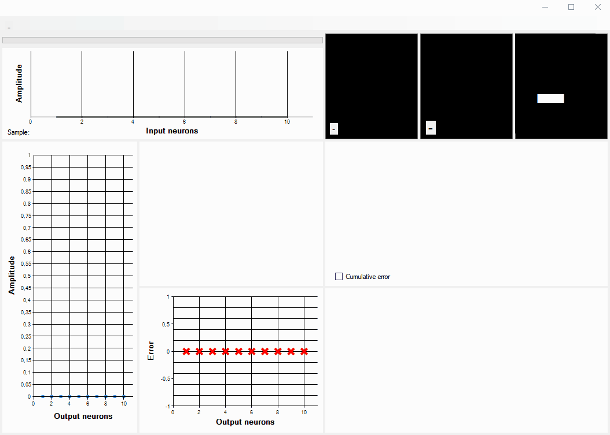

# NeuralLibrary

C# DLL library with demo UI app for creating, training and validation neural network models

## Features 

- Neural network models creation with variable structure in object oriented style
- Neural networks training with with a given learning rate, iterations, epochs, input signals
- Four demo learning modes included:
  - Training models to recognize images with rotation. MNIST handwritten digits database tested (png images)
  - Training models to recognize noisy sinusoidal signals
  - Drawing with mouse in interactive mode to train model recognition of any kind of user paintings
  - Signal approximation with neural networks
- Validation with real-time monitoring of errors, weights values and neuron outputs on charts
- Saving pre-trained models to .mdl file at any training state
- Loading pre-trained models from files
- DLL to use neural networks in your project
- Currently only multilayer perceptron network is supported

Created from scratch for educational purposes.

Used as secondary method in [LINK] project to recognize controlled object state by vibroacoustic signals.

#### MNIST digits and user images recognition

 

#### Approximation with neural network

#### 

#### Quick MNIST 5 digits training/validation test: 784x50x5, 3 epochs x 1000 samples

#### Accuracy: 2329/2500 = 93,16%


#### Full MNIST 10 digits validation: 784x400x10, 8 epochs x 50000 samples

#### Accuracy: 4776/5000 = 95,52%


## Run Demo App

Unpack "unpack_to_exe_folder.zip" with mnist images, user icons and pre-trained models to "Debug" and "Release" folders.

Launch "MyNeuralNetwork.sln" and compile.

- Created in Visual Studio Community 2019
- .Net Framework 4.7.2

- MathNet.Numerics is used for weights generation with normal distribution

## DLL Usage

#### Code example of 800x400x200x30 multilayer perceptron training on 30 different noisy signals (1 to 31Hz) with 0.005 learning rate / 5 epochs x 1000 samples

#### Accuracy 99,17%, see results below

```
// - Add NeuralLibrary.dll and MathNet.Numerics.dll references to project in Visual Studio
// - Add "using NeuralLibrary;"
// - Add "using MathNet.Numerics;"
// To simplify the example, each network output value corresponds to [frequency value + 1 Hz] signal class

int epochs = 5;
int iterations = 1000;
int inputNeurons = 784; // Inputs
int[] hiddenLayers = { 400, 200 }; // Two hidden layers array
int outputNeurons = 30; // Outputs
double learningRate = 0.005; // Learning rate
Random rndClass = new Random();
Random rndAmplitude = new Random();

network = new Network(outputNeurons, learningRate); // Create new Network object with 30 outputs
network.CreateInputLayer(inputNeurons, hiddenLayers[0]); // Create input layer, connected to first hidden
network.CreateHiddenLayers(hiddenLayers, outputNeurons); // last is connected to output
network.CreateOutputLayer(outputNeurons, 0); // Create output layer
signal = new Signal(inputNeurons); // Create signal object

for (int i = 0; i < epochs; i++) 
{
    for (int j = 0; j < iterations; j++) 
    {
        int classToTrain = rndClass.Next(0, 30); // Randomize desired output (network performs badly without shuffling data)         	 signal.GenerateSinus(classToTrain + 1, rndAmplitude); // Generate noisy amplitudes with [classToTrain + 1 Hz] freq
        //signal.ImageFromFile(pathToImage, rotateAngle); // or load image according to classToTrain value
        network.SetTarget(classToTrain); // Set desired output and reset others
        network.SendSignalsToInputLayer(signal.Amplitude); // Send signal to input layer 
        // network.SendSignalsToInputLayer(myDoubleArray); // or send any double[] array with your data        
        network.Pass(); // Forward propagation -> back propagation with stochastic gradient descent        
        // Or, instead of Pass() method, you can call separately:
        network.ForwardPropagation();
        network.FindNetworkOutputError();
        network.NeuronErrorDistribution();
        network.RecalculateWeights();
        network.CleanOldData();
    }
}
```

#### Code example results: training/validation on 30 noisy signal classes with 800x400x200x30 network, 5 epochs x 1000 samples

#### Accuracy: 14875/15000 = 99,17%


