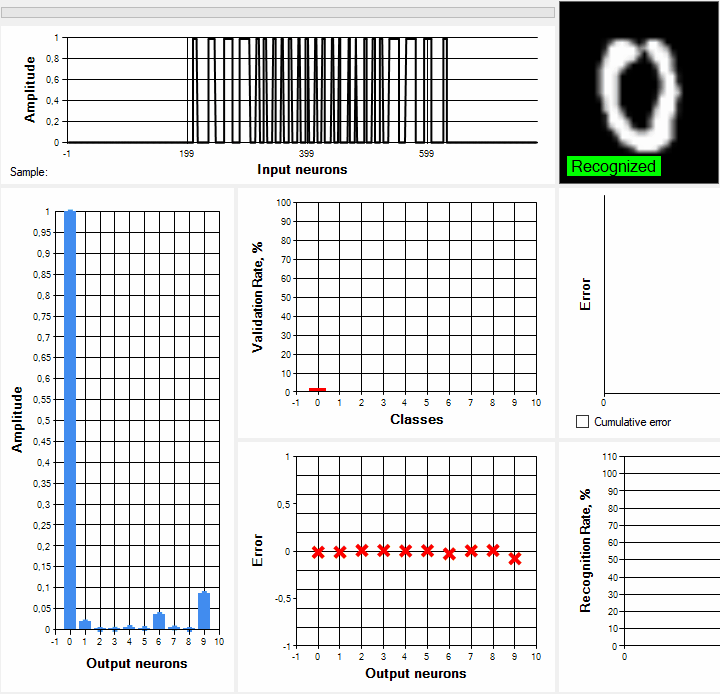

# NeuralLibrary

C# DLL library with demo UI app for creating, training and validation neural network models

## Features 

- Creating neural network models with variable structure in object oriented style
- Training neural networks with with a given learning rate, iterations, epochs, input signals
- Three demo learning modes included:
  - Training models to recognize images with rotation. MNIST handwritten digits database tested (png format)
  - Drawing with mouse in interactive mode to train model recognition of any kind of user paintings
  - Training models to recognize noisy sinusoidal signals
- Validation with real-time monitoring of errors, weights values and neuron outputs on charts
- Saving pre-trained models to file at any training state
- Loading pre-trained models from files
- DLL library to use neural networks in your project

Created from scratch for educational purposes.

Used as secondary method in [LINK] project to recognize controlled object state by vibroacoustic signals.

## Quick MNIST 5 digits training/validation: 784x50x5, 3 epochs x 1000

##### Accuracy: 2329/2500 = 93,16%



## MNIST 10 digits validation: 784x400x10, 8 epochs x 50000

##### Accuracy: 4776/5000 = 95,52%


## Quick noisy signal train/validation:  800x200x100x40, x epochs x


## DLL Usage

Example of creating 800x200x100x40 multilayer perceptron and training on 40 noisy signals (1 to 41Hz) with 0.05 learning rate / 5 epochs

```
// - Add NeuralLibrary.dll reference to project in Visual Studio
// - Add "using NeuralLibrary;"
// To simplify the example, each network output corresponds to [frequency value + 1 Hz] signal class

int epochs = 5;
int iterations = 1000;
int inputNeurons = 784; // Inputs
int[] hiddenLayers = { 200, 100 }; // Two hidden layers array
int outputNeurons = 10; // Outputs
double learningRate = 0.05; // Learning rate
Random rndClass = new Random();
Random rndAmplitude = new Random();

network = new Network(outputNeurons, learningRate); // Create new Network object with 10 outputs
network.CreateInputLayer(inputNeurons, hiddenLayers[0]); // Create input layer, connected to first hidden
network.CreateHiddenLayers(hiddensLayers, outputNeurons); // last is connected to output
network.CreateOutputLayer(outputNeurons, 0); // Create output layer
signal = new Signal(inputNeurons); // Create signal object

for (int i = 0; i < epochs; i++) 
{
    for (int j = 0; j < iterations; j++) 
    {
        int classToTrain = rndClass.Next(0, 40); // Randomize desired output (network performs badly without shuffling data)         	 signal.GenerateSinus(classToTrain + 1, rndAmplitude); // Generate noisy amplitudes with [classToTrain + 1 Hz] freq
        //signal.ImageFromFile(pathToImage, rotateAngle); // or load image according to classToTrain value
        network.SetTarget(classToTrain); // Set desired output and reset others
        network.SendSignalsToInputLayer(signal.Amplitude); // Send signal to input layer 
        // network.SendSignalsToInputLayer(myDoubleArray); // or send any double[] array with your data        
        network.Pass(); // Forward propagation -> back propagation with stochastic gradient descent
    }
}
```

